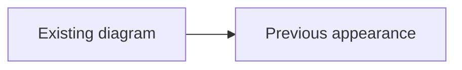

# Mermaid for Zed

Mermaid language support for Zed, updated and tested against **Mermaid 12.0.0**
(the current stable release checked on 2026-09-13).
This is a fork of [gabeins/zed-mermaid](https://github.com/gabeins/zed-mermaid).

The extension provides syntax highlighting for `.mermaid` / `.mmd` files and
Mermaid code fences in Markdown, a diagram outline, and YAML front matter
highlighting when Zed's YAML language is available. The original file associations,
language name, extension ID, and `%%` line comments are preserved.

## Install this fork

The extension gallery entry still points to the upstream extension. To use this
fork:

```sh
git clone --branch update/mermaid-12 https://github.com/lucaschoeneberg/zed-mermaid.git
```

1. Open Zed's Extensions panel (`cmd-shift-x` on macOS or `ctrl-shift-x`).
2. Choose **Install Dev Extension** and select the cloned repository directory.
3. Open a `.mmd` or `.mermaid` file, or select **Mermaid** as the language.

Use a current stable Zed release with Tree-sitter ABI 15 support. Zed builds the
committed grammar with WASI SDK; the first installation needs network access to
fetch its compiler and the pinned grammar revision. See
[Zed's development guide](https://zed.dev/docs/extensions/developing-extensions).
The `mermaid` ID intentionally replaces the installed upstream extension while
this dev extension is active. This fork has not been published to the gallery.

## What is supported

| Level                                                                  | Diagram families                                                                                                                                                                                     |
| ---------------------------------------------------------------------- | ---------------------------------------------------------------------------------------------------------------------------------------------------------------------------------------------------- |
| Structured rules for common statements, labels, and relationships      | Flowchart/graph, Sequence, Class, State, ER, Gantt, Pie, Journey, Mindmap, Requirement, GitGraph, Timeline, Quadrant, Architecture, Packet, Radar, Tree View, Event Modeling, Wardley, Cynefin, Info |
| New declarations and reused flowchart rules                            | Mermaid 12 **Use Case** (`usecase-beta`) and **Agentflow** (`agentflow-beta`); **Swimlanes** (`swimlane-beta`)                                                                                       |
| Header recognition and basic token highlighting with tolerant fallback | Block, C4, Kanban, XY chart, Sankey, Treemap, Ishikawa, Venn, Railroad (IR, EBNF, ABNF, PEG), ZenUML                                                                                                 |

New flowchart shape/edge metadata (`@{ ... }`), edge IDs, comments, directives,
front matter, and accessibility statements are handled by the grammar. Support
levels describe editor highlighting: even a structured family can contain syntax
that falls back to basic tokens. Beta syntax follows Mermaid and may change.
See [test/fixtures](test/fixtures) for executable compatibility examples.

This remains a **language extension**. It does not bundle a browser renderer,
provide live preview, or install a language server for diagnostics/completion.
Mermaid 12 is pinned as a **development dependency** to validate real diagrams in
the test suite. Installing it here cannot upgrade a renderer built into Zed or
another preview extension. Rendering, layout, animation, and icon packs depend on
that renderer. ZenUML requires a separate Mermaid integration; it is recognized
by the editor grammar but is not part of the bundled Mermaid parser tests.

## Develop and verify

Use Node.js **22.12+** (Node 24 LTS recommended; `.nvmrc` selects 24), npm, Git, and
a native C compiler for the corpus tests. End users do not need npm to load the
extension.

```sh
npm ci
npm run generate  # regenerate the checked-in C parser, ABI 15
npm run build     # compile grammars/mermaid.wasm
npm run lint      # formatting, TOML/config validation, immutable grammar pin
npm test          # native corpus, Mermaid parsing, WASM and Zed query tests
npm audit --audit-level=high
```

`npm run check` runs lint, build, and tests. Build tools download WASI SDK 34 and
Binaryen 132 on first use; their versions are selected by Tree-sitter CLI 0.27.0.
Temporary downloads stay in `.cache/`. All direct development dependencies and
their complete dependency graph are locked in `package-lock.json`.

CI runs the same checks on Node 22, 24, and 26, verifies regeneration leaves the
committed parser unchanged, and uploads the compiled grammar. Tests cover the 18
original grammar cases, current Mermaid diagram examples, exact semantic captures,
YAML injection, the diagram outline, and recovery around unfamiliar syntax.
The tests validate parsing and queries; they do not assert rendered SVG appearance
or replace an interactive Zed smoke test.

Zed uses `grammars.mermaid.repository`, `rev`, and `path` from `extension.toml` to
build the grammar. The manifest references an immutable commit in this fork and
the `grammar/` subdirectory. After modifying grammar sources, commit those first,
then update the manifest revision in a second commit. See
[grammar/README.md](grammar/README.md) for the maintenance workflow.

## Migrating Mermaid 12 diagrams

Mermaid 12 requires ES2024 / Safari 17.4+ and Node 22.12+ for integrations. It uses
ELK as the default layout for the applicable diagram families and changes their
default theme/look to `redux-color` / `neo`. To preserve the previous appearance
in a Mermaid 12 renderer, set these explicitly:



Replace `flowchart.defaultRenderer`, `class.defaultRenderer`, and
`state.defaultRenderer` with the top-level `layout` option. The old options are
ignored in Mermaid 12. Our tests use the public `mermaid.parse()` API and do not
rely on removed internal layout exports. Details are in the
[Mermaid 12 release notes](https://github.com/mermaid-js/mermaid/releases/tag/mermaid%4012.0.0)
and [CHANGELOG.md](CHANGELOG.md).

## Acknowledgments

- Original Zed extension: [gabeins/zed-mermaid](https://github.com/gabeins/zed-mermaid).
- Current grammar basis: [pappasam/tree-sitter-mermaid](https://github.com/pappasam/tree-sitter-mermaid), MIT; the vendored source and local additions are in `grammar/`.
- Original grammar: [monaqa/tree-sitter-mermaid](https://github.com/monaqa/tree-sitter-mermaid).
- Compatibility examples: [Mermaid](https://github.com/mermaid-js/mermaid), MIT;
  source links and license are in `test/fixtures/`.
